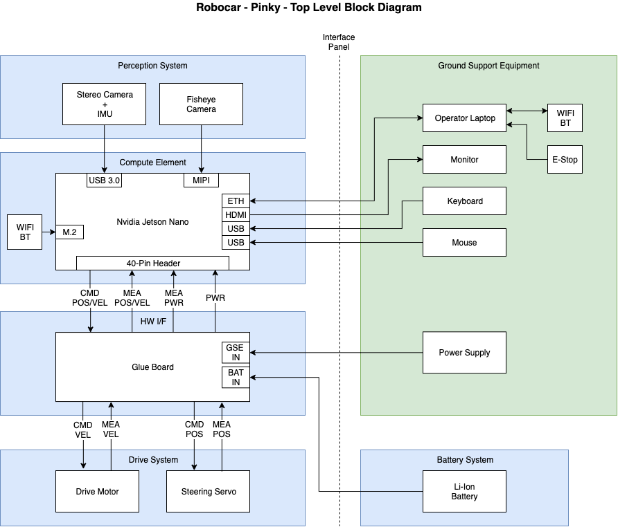

# Robocar - Pinky	

## Intro
Pinky is a 1/16 scale DIY autonomous car designed to compete in the [DIY Robocar](https://diyrobocars.com) races. Pinky also has a counterpart testbed named [Brain](Brain).

## Design

## Bill of Materials

### Perception System
Part | Cost  |  Link
------------ | ------------- | -------------
oCamS-1CGN-U Stereo Camera Module Depth Sensor IMU | $199.95 | [Amazon](https://www.amazon.com/Stereo-Shutter-Disparity-WITHROBOT-oCamS-1CGN-U/dp/B07R5NG6HK/)
SainSmart IMX219 Camera Module | $29.99  | [Amazon](https://www.amazon.com/gp/product/B07VFFRX4C)

### Compute Element
Part | Cost  |  Link
------------ | ------------- | -------------
NVIDIA Jetson Nano Developer Kit | $98.98 | [Amazon](https://www.amazon.com/gp/product/B07PZHBDKT/)

### Hardware Interface Board
*** Link to GitHub coming soon ***

### Drive System
Part | Cost  |  Link
------------ | ------------- | -------------
VATOS RC Car 9137R | $54.99 | [Amazon](https://www.amazon.com/gp/product/B07QRRJZDG/)

### Other
Part | Cost  |  Link
------------ | ------------- | -------------
Samsung SD Car 128GB | $16.99 | [Amazon](https://www.amazon.com/gp/product/B06XWZWYVP/)
1.5 ft/50cm Micro USB 3.0 Cable | $8.79 | [Amazon](https://www.amazon.com/gp/product/B075CL915V/)
5V/4A 20W Switching Power | $8.99 | [Amazon](https://www.amazon.com/gp/product/B01N4HYWAM/)

## Hardware
*** Coming Soon ***

## Software
*** Coming Soon ***