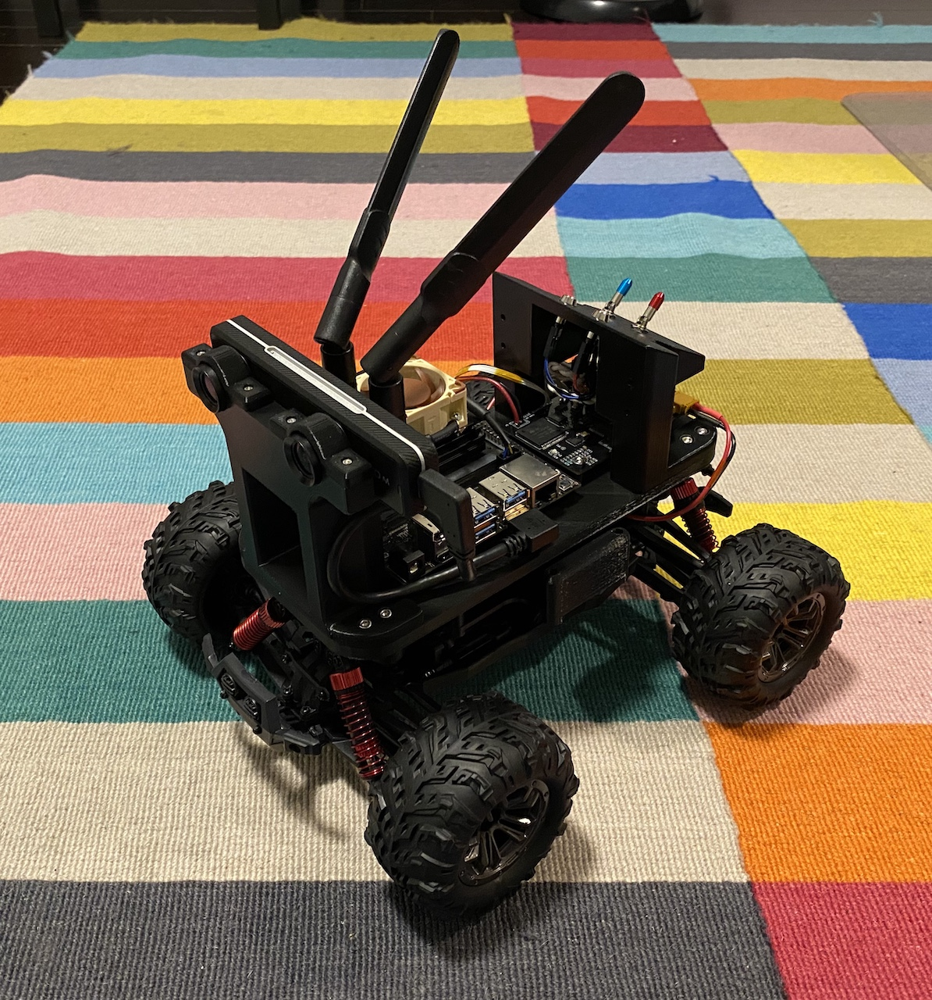

# Robocar - Pinky	

## Intro
Pinky is a 1/16 scale DIY autonomous car designed to compete in the [DIY Robocar](https://diyrobocars.com) race. Pinky also has a counterpart testbed named [Brain](Brain).

## Design

### Block Diagram

### Assembled Hardware

## Hardware

### Perception System
Part | Cost  |  Link
------------ | ------------- | -------------
ZED Mini | $399.00 | [Stereo Labs Store](https://store.stereolabs.com/products/zed-mini)
IMX219 Camera Module (Fisheye) | $29.99  | [Amazon](https://www.amazon.com/gp/product/B07VFFRX4C)

### Compute Element
Part | Cost  |  Link
------------ | ------------- | -------------
NVIDIA Jetson Nano Developer Kit | $98.98 | [Amazon](https://www.amazon.com/gp/product/B07PZHBDKT/)
Intel Dual Band Wireless-Ac 8265 w/ BT Module | $21.55 | [Amazon](https://www.amazon.com/Intel-Dual-Band-Wireless-Ac-8265/dp/B01MZA1AB2)
Noctua Fan | $14.95 | [Amazon](https://www.amazon.com/gp/product/B071FNHVXN)

### Hardware Interface Board
Part | Cost  |  Link
------------ | ------------- | -------------
Glue Board | ~$300.00 | [GitHub](./Electronics/Glue\ Board)

### Drive System
Part | Cost  |  Link
------------ | ------------- | -------------
VATOS RC Car 9137R | $54.99 | [Amazon](https://www.amazon.com/gp/product/B07QRRJZDG/)

### Chassis
Part | Cost | Link
------------ | ------------- | -------------
Screw Set | $20.98 | [Amazon](https://www.amazon.com/gp/product/B07QLWPJKC/)
Heat Insert | $19.99 | [Amazon](https://www.amazon.com/gp/product/B07MWBJB67)
3D Printable Models | ~$20.00 | [GitHub](./Mechanical/CAD/STL\ Files)

### Other
Part | Cost  |  Link
------------ | ------------- | -------------
ENGPOW 7.4V 3000mah 30C Lipo Battery | $22.99 | [Amazon](https://www.amazon.com/gp/product/B075QDPSDQ/)
Samsung SD Car 128GB | $16.99 | [Amazon](https://www.amazon.com/gp/product/B06XWZWYVP/)
1.5 ft/50cm Micro USB 3.0 Cable | $8.79 | [Amazon](https://www.amazon.com/gp/product/B075CL915V/)
5V/4A 20W Switching Power | $8.99 | [Amazon](https://www.amazon.com/gp/product/B01N4HYWAM/)
WiFi/BT Antennas | $13.99 | [Amazon](https://www.amazon.com/gp/product/B01E29566W/)
USB 3.1 Right Angle A to Right Angle C | $19.25 | [UsbFirewire](https://www.usbfirewire.com/parts/rr-arch-xxg.html#RR-ARCH-10GRC)

## Software

See GitHub repository folder: [Software](./Software) 